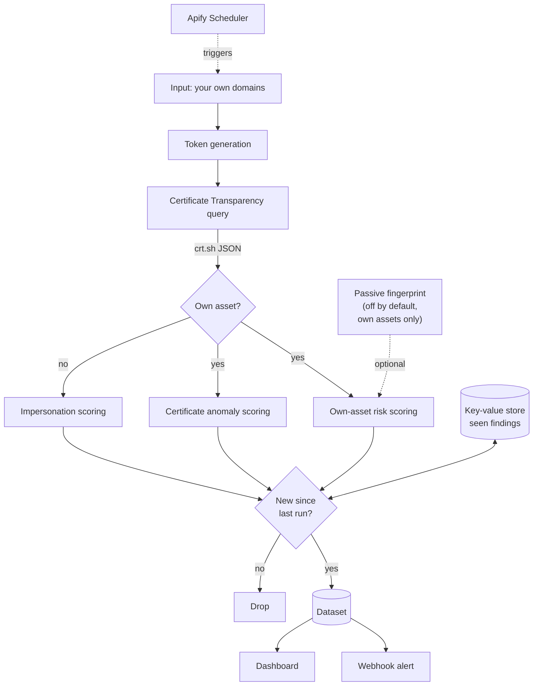

# SentinelNG

External attack surface monitoring for financial institutions, built on public Certificate Transparency logs.

Submitted to **Ship and Earn Africa**, the Apify x She Code Africa BuildHer Hackathon 2026. Track: Cybersecurity.

---

## The problem

Nigerian financial institutions are being breached through infrastructure they forgot they exposed, and impersonated through domains built to phish their customers. Three real incidents, three different attack types, one common thread: each left a public trace in Certificate Transparency logs at the moment it began.

**Sterling Bank, March 2026.** Attackers entered through an unpatched pilot server, `enf-pilot.sterling.ng`, maintained access for nine days, then pivoted into Remita, exposing roughly 900,000 customer records and 3 terabytes of national payment data. A forgotten, internet-facing asset was the entry point.

**GTBank, August 2024.** Attackers compromised control of the `gtbank.com` domain one day after it was renewed, and inserted a fake layer to harvest customer logins. A domain-control compromise, visible as an unexpected certificate on the main domain.

**Ongoing, sector-wide.** Lookalike domains carrying fresh certificates are stood up to phish bank and fintech customers over SMS, WhatsApp, and paid search.

Every internet-facing asset needs a TLS certificate, and every certificate is logged to public Certificate Transparency logs within minutes. All three attack types surface there. Almost no Nigerian institution is watching.

## What SentinelNG does

Give it your own domain. It gives you the attacker's outside view of your estate, using only public data, and sorts what it finds into three types:

| Finding type | What it catches | Real-world case |
|---|---|---|
| `own_asset_risk` | Forgotten and non-production assets: pilot, staging, dev, uat, legacy, plus auxiliary services worth inventorying | Sterling Bank pilot server |
| `cert_anomaly` | A certificate on your own domain from an unexpected issuer, or expired-but-live certificates | GTBank domain compromise |
| `impersonation` | Lookalike domains built to phish your customers | Sector-wide phishing |

Every finding is scored 0 to 100, banded critical, high, medium, or low, and carries a plain-language reason list so a security team can act and justify the action.

---

## Architecture



### Why each Apify component is load-bearing

| Component | Why it is needed |
|---|---|
| Actor + input schema | A security team operates it through a generated form, no code |
| Scheduler | Attack surface changes weekly. Continuous discovery is the product |
| Key-value store | Each run reports only what is new. Without state, the output is noise |
| Dataset + API | Findings are a feed pulled into the customer's own tooling and the dashboard |
| Webhooks | Detection without delivery is not a product |
| Standby mode | Same discovery logic as a live API for on-demand and bulk checks |
| Apify Proxy | Distributes CT queries when assessing very large estates |
| Apify Store | Distribution and monetisation to institutions priced out of enterprise tools |

---

## Detection detail

### Discovery

The organisation's own domains are turned into Certificate Transparency search tokens. A substring search on the brand root returns the whole real estate plus most lookalikes in one query. Every certificate is read from both the `name_value` and `common_name` fields, because crt.sh sometimes places the hostname in only one of them.

### Own-asset risk

Hostnames are classified by label. High-risk labels (`pilot`, `staging`, `dev`, `uat`, `test`, `legacy`, `old`, `bak`, `vpn`, `admin`, and others) mark forgotten or non-production infrastructure. This is the Sterling Bank signature. Auxiliary-service labels (`mail`, `livechat`, `limesurvey`, `servicedesk`, `ebank`, `webapp`) are surfaced for inventory, since third-party widgets and helpdesks are real attack surface.

### Certificate anomaly

The tool learns which certificate authorities normally issue for the estate, using only long-lived commercial certificates (over 120 days validity) as the baseline. A certificate appearing on an owned domain from outside that set is flagged as a possible domain or DNS compromise, the GTBank signature. Building the baseline from established certs is deliberate: an attacker's fresh short-lived free certificate cannot teach the tool to expect itself. Expired-but-live and soon-to-expire certificates are also flagged.

### Impersonation

Domains the organisation does not own are scored for brand containment, edit distance, phishing keywords, Unicode homoglyphs, high-risk TLDs, free certificate authorities, and brand names on free hosting. Domains too far from the brand to be plausible impersonation are dropped rather than reported as noise. Unicode lookalikes are folded to ASCII before matching, so a domain using a Cyrillic character still matches the brand it imitates.

### Passive fingerprint, off by default

An optional module performs a single HTTP GET to the homepage of assets the operator owns, reads only what the server volunteers in headers and the page, and correlates the technology against a table of known CVEs. It reports "runs a technology with a known CVE, verify your version" as awareness. **It never probes, never tests a vulnerability, never touches a path other than the root, and runs only against owned assets.** Confirming a vulnerability would require testing, which would be unauthorised access. That legal boundary is exactly what makes the tool safe for a customer to buy and run.

---

## Running it

### Locally

```bash
git clone https://github.com/ChisomJude/sentinelng.git
cd sentinelng

python3 -m venv .venv && source .venv/bin/activate
pip install -r requirements.txt

apify login
apify run --input '{
  "organization_domains": ["sterling.ng"],
  "min_score": 35,
  "detect_impersonation": true
}'
```

### On Apify

```bash
apify push
```

Then set a schedule in Apify Console. Hourly is recommended for a bank or PSP.

### Input reference

| Field | Type | Default | Notes |
|---|---|---|---|
| `organization_domains` | array | required | Your own domains, including subsidiaries |
| `min_score` | int | `35` | Lower to 20 to see the full inventory |
| `detect_impersonation` | bool | `true` | Also hunt lookalike domains |
| `alert_severities` | array | `["critical","high"]` | Which levels reach the webhook |
| `webhook_url` | string | none | Slack, Teams, SOAR, or your pipeline |
| `enable_fingerprint` | bool | `false` | Passive, own assets only, see above |
| `use_apify_proxy` | bool | `false` | Only for very large estates |

---

## Dashboard

A single static HTML file that reads directly from the Apify Dataset API. No backend, no build step.

```bash
cd dashboard
vercel deploy --prod
```

Paste the dataset ID from any run to view findings ranked by risk.

**Why Vercel and not a VPS.** The Actor runs on Apify, so there is no application server to host. The dashboard is one static file, so Vercel gives it global CDN delivery, free TLS, and a custom subdomain for nothing. A VPS would add an OS to patch and certificates to renew for a page that needs no runtime.

---

## Who this is for

Tier-one banks often have an enterprise brand-protection vendor. The opening is one layer down, where exposure is identical and enterprise contracts are out of reach: mid-size and regional banks, microfinance banks, fintechs, PSPs and processors, insurers, and crypto and remittance operators.

**What the buyer gets.** The attacker's own view of their estate, continuously, so the forgotten server is found by them and not by an intruder. Sterling was 900,000 records and a 3TB pivot from one unwatched server. Against that, a monitoring subscription is a rounding error. It is a subscription, not a one-off, because the attack surface changes every week.

The NDPC opened a formal investigation into the Sterling and Remita breaches in April 2026, and there is currently no regulation requiring Nigerian institutions to maintain a minimum external security posture. Every board is being asked what its exposure is. SentinelNG is the answer.

---

## Limitations

Stated plainly, because a tool that overclaims gets switched off.

- **Detection, not remediation.** SentinelNG finds the exposure. Takedown and patching are separate workflows.
- **Passive by design.** It reports probable exposure from public data, never confirmed vulnerability, because confirming would require testing infrastructure and crossing a legal line. This is a deliberate boundary, not a gap.
- **CT covers publicly trusted certificates only.** An asset on plain HTTP or behind a private CA will not appear. In practice exposed assets carry public certificates, which is why the coverage holds.
- **The domain-compromise signal depends on a new certificate.** It detects the certificate signature of that attack class, which usually but not always accompanies it.
- **Suppression needs tuning per organisation.** The first week involves adding legitimate subsidiaries and partners to the domain list.
- **crt.sh is a free community service.** Response times vary. Concurrency is low and failures are retried and reported.

---

## Repository layout

```
sentinelng/
├── .actor/
│   ├── actor.json           Actor manifest and dataset view
│   └── input_schema.json    Generates the Console input form
├── .github/workflows/
│   ├── ci.yml               Lint, test, validate config, build image
│   └── deploy.yml           Push Actor to Apify, dashboard to Vercel
├── src/
│   ├── main.py              Orchestration, state, dataset, webhook
│   ├── discovery.py         Token generation and hostname classification
│   ├── ct_client.py         Certificate Transparency queries
│   ├── scoring.py           Three-way finding classification and scoring
│   └── fingerprint.py       Passive CVE awareness, off by default
├── dashboard/
│   ├── index.html           Static findings dashboard
│   └── vercel.json          Deployment config
├── tests/
│   └── test_detection.py    18 offline tests
├── docs/
│   └── user-guide.pdf       Operator guide
├── Dockerfile
├── pyproject.toml
└── requirements.txt
```

## Licence

MIT.
