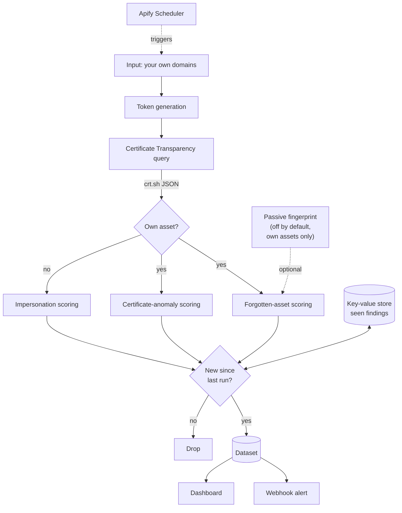

# SentinelNG

**Know what you expose, before an attacker does.**

External attack surface monitoring for financial institutions, built on public Certificate Transparency logs. Give it your domain. It shows you your estate the way an attacker sees it, using only public data, without ever touching your systems.

Live dashboard: **https://sentinelng-three.vercel.app/**

Live on Apify Store: `apify.com/godstimechisom/sentinel`

Source: **https://github.com/ChisomJude/sentinelng**

Built for **Ship and Earn Africa**, the Apify x She Code Africa BuildHer Hackathon 2026. Track: Cybersecurity.

---

## The problem

Nigerian financial institutions are being breached through infrastructure they forgot they exposed, and impersonated through domains built to phish their customers. Three real incidents, three different attack types, one common thread: each left a public trace in Certificate Transparency logs at the moment it began.

**Sterling Bank, March 2026.** Attackers entered through an unpatched pilot server, `enf-pilot.sterling.ng`, maintained access for nine days, then pivoted into Remita, exposing roughly 900,000 customer records and 3 terabytes of national payment data. A forgotten, internet-facing asset was the entry point.

**GTBank, August 2024.** Attackers compromised control of the `gtbank.com` domain one day after it was renewed, and inserted a fake layer to harvest customer logins. A domain-control compromise, visible as an unexpected certificate on the main domain.

**Ongoing, sector-wide.** Lookalike domains carrying fresh certificates are stood up to phish bank and fintech customers over SMS, WhatsApp, and paid search.

Every internet-facing asset needs a TLS certificate, and every certificate is logged to public Certificate Transparency logs within minutes. All three attack types surface there. Almost no Nigerian institution is watching.

---

## This is not hypothetical

Run against `gtbank.com`, from public data alone, SentinelNG surfaces:

- `gasset-pilot.gtbank.com`, a pilot server, the exact class of asset that breached Sterling
- `gasset-dev.gtbank.com`, a development environment
- `staging.gtbank.com` and `cdn-staging.gtbank.com`, staging environments
- `gasset-test.gtbank.com` and `test-mbank.gtbank.com`, test environments

Non-production environments, exposed on a live bank's domain, found without touching anything. A security team seeing this would confirm whether each is still needed and properly secured. This is the forgotten-asset problem, live, on a real institution.

---

## How SentinelNG would have changed the breaches

**Sterling.** The pilot server needed a certificate, and it hit the public logs the day it went up. SentinelNG, monitoring `sterling.ng`, would have seen a new host carrying the label `pilot`, flagged it as a forgotten, non-production asset exposed to the internet, and alerted the team at issuance, before the nine days the attacker spent inside.

**GTBank.** When attackers stood up their fake layer, they provisioned a new certificate, which appeared in the logs within minutes, on the real domain, from a certificate authority the bank does not use. SentinelNG would have flagged a brand-new certificate on the apex domain from an unexpected issuer, hours old, as a possible domain compromise, potentially before customers were phished.

Honest scope: SentinelNG surfaces exposure early and turns it into an alert a human can act on. It does not patch, block, or take anything down. Its job is to make sure the thing that starts the breach is never something nobody was watching.

---

## What it does

Give it your own domain. It gives you the attacker's outside view of your estate, using only public data, and sorts what it finds into three types:

| Finding type | What it catches | Real case it echoes |
|---|---|---|
| Forgotten asset | Non-production and abandoned hosts: pilot, staging, dev, uat, legacy, plus auxiliary services worth inventorying | Sterling Bank |
| Certificate anomaly | A new certificate on your own domain from an unexpected issuer, or expired-but-live certificates | GTBank |
| Impersonation | Lookalike domains you do not own, built to phish your customers | Sector-wide phishing |

Every finding is scored 0 to 100, banded critical, high, medium, or low, and carries a plain-language reason list so a security team can act and justify the action.

**It is 100 percent passive.** It reads public logs, the same records every browser relies on. It never scans, probes, or touches the target. Confirming a vulnerability would mean testing infrastructure you may not own, which is the line SentinelNG does not cross. Passive is what makes it legal to buy and run.

---

## Architecture



Runs on a schedule. Reads only public data. Reports what an attacker can already see.

### Why each Apify component is load-bearing

| Component | Why it is needed |
|---|---|
| Actor + input schema | A security team operates it through a generated form, no code |
| Scheduler | Attack surface changes weekly. Continuous discovery is the product |
| Key-value store | Each run reports only what is new. Without state, the output is noise |
| Dataset + API | Findings are a feed pulled into the customer's own tooling and the dashboard |
| Webhooks | Detection without delivery is not a product |
| Standby mode | Same discovery logic as a live API for on-demand and bulk checks |
| Apify Proxy | Distributes CT queries when assessing very large estates |
| Apify Store | Distribution and monetisation to institutions priced out of enterprise tools |

---

## Detection detail

### Discovery

The organisation's own domains are turned into Certificate Transparency search tokens. A substring search on the brand root returns the whole real estate plus most lookalikes in one query. Every certificate is read from both the `name_value` and `common_name` fields, because crt.sh sometimes places the hostname in only one of them. Wildcard certificates are recorded as wildcards rather than silently flattened, so their wider blast radius can be scored.

### Forgotten assets (own-asset risk)

Hostnames are classified by label. High-risk labels (`pilot`, `staging`, `dev`, `uat`, `test`, `legacy`, `old`, `bak`, `vpn`, `admin`, and others) mark forgotten or non-production infrastructure. This is the Sterling Bank signature. Auxiliary-service labels (`mail`, `livechat`, `limesurvey`, `servicedesk`, `ebank`, `webapp`) are surfaced for inventory, since third-party widgets and helpdesks are real attack surface. A wildcard certificate on an already-flagged asset adds to the score, because one key then covers every host under the name, but a wildcard on a healthy production host does not manufacture a finding on its own.

### Certificate anomaly

An unexpected issuer alone is not treated as an alarm. Most of the web uses free certificate authorities like Let's Encrypt, and a years-old auto-renewing certificate is routine, not a compromise. So an unexpected issuer on its own scores low and is framed as a review prompt: confirm you recognise this asset and its certificate.

It escalates to high or critical only when the unexpected certificate is genuinely recent, issued within the last 72 hours, and on a sensitive host: the apex domain, or a hostname carrying an authentication or login label. That recent-plus-sensitive combination is the GTBank domain-compromise signature. Building the escalation on recency is deliberate: a fresh rogue certificate cannot masquerade as routine, and routine old certificates cannot cry wolf. Expired-but-live certificates are also flagged for hygiene.

### Impersonation

Domains the organisation does not own are scored for brand containment, edit distance, phishing keywords, Unicode homoglyphs, high-risk TLDs, free certificate authorities, and brand names on free hosting. Domains too far from the brand to be plausible impersonation are dropped rather than reported as noise. Unicode lookalikes are folded to ASCII before matching, so a domain using a Cyrillic character still matches the brand it imitates.

### Passive fingerprint, off by default (roadmap)

An optional module, disabled by default, performs a single HTTP GET to the homepage of assets the operator owns, reads only what the server volunteers in headers and the page, and correlates the technology against a table of known CVEs. It reports "runs a technology with a known CVE, verify your version" as awareness. It never probes, never tests a vulnerability, never touches a path other than the root, and runs only against owned assets. Confirming a vulnerability would require testing, which would be unauthorised access. That legal boundary is exactly what keeps the tool safe to buy and run.

---

## Built on Apify

Python, using the Apify SDK for Python and the Apify CLI for local development and deployment. The Actor uses the platform as its engine, not as a one-off script: scheduled runs for continuous monitoring, the key-value store for run-to-run state, datasets and the Dataset API for findings, webhook alerts for delivery, Apify Proxy for large estates, and pay-per-event monetisation on Apify Store.

### Running it

Locally:

```bash
git clone https://github.com/ChisomJude/sentinelng.git
cd sentinelng

python -m venv .venv && source .venv/Scripts/activate   # Windows
pip install -r requirements.txt

apify login
apify run --input '{
  "organization_domains": ["gtbank.com", "gtbankci.com"],
  "min_score": 20,
  "detect_impersonation": true
}'
```

On Apify: push the code, then set a schedule in the Console. Hourly is recommended for a bank or PSP.

### Input reference

| Field | Type | Default | Notes |
|---|---|---|---|
| `organization_domains` | array | required | Your own domains, including subsidiaries |
| `min_score` | int | `35` | Lower to 20 to see the full inventory |
| `detect_impersonation` | bool | `true` | Also hunt lookalike domains |
| `alert_severities` | array | `["critical","high"]` | Which levels reach the webhook |
| `webhook_url` | string | none | Slack, Teams, SOAR, or your pipeline |
| `enable_fingerprint` | bool | `false` | Passive, own assets only, see above |
| `use_apify_proxy` | bool | `false` | Only for very large estates |

---

## Dashboard

Live at **https://sentinelng-three.vercel.app/**

A single static HTML file that reads directly from the Apify Dataset API. No backend, no build step. Paste the dataset ID from any run to view findings ranked by risk.

**Why static hosting and not a VPS.** The Actor runs on Apify, so there is no application server to host. The dashboard is one static file, so a static host gives it global CDN delivery, free TLS, and a custom subdomain for nothing. A VPS would add an OS to patch and certificates to renew for a page that needs no runtime.

---

## Who this is for

Tier-one banks often have an enterprise brand-protection vendor. The opening is one layer down, where exposure is identical and enterprise contracts are out of reach: mid-size and regional banks, microfinance banks, fintechs, PSPs and processors, insurers, and crypto and remittance operators.

**What the buyer gets.** The attacker's own view of their estate, continuously, so the forgotten server is found by them and not by an intruder. Sterling was 900,000 records and a 3TB pivot from one unwatched server. Against that, a monitoring subscription is a rounding error. It is a subscription, not a one-off, because the attack surface changes every week.

The NDPC opened a formal investigation into the Sterling and Remita breaches in April 2026, and there is currently no regulation requiring Nigerian institutions to maintain a minimum external security posture. Every board is being asked what its exposure is. SentinelNG is the answer.

---

## Limitations

Stated plainly, because a tool that overclaims gets switched off.

- **Detection, not remediation.** SentinelNG finds the exposure. Takedown and patching are separate workflows.
- **Passive by design.** It reports probable exposure from public data, never confirmed vulnerability, because confirming would require testing infrastructure and crossing a legal line. This is a deliberate boundary, not a gap.
- **CT covers publicly trusted certificates only.** An asset on plain HTTP or behind a private CA will not appear. In practice exposed assets carry public certificates, which is why the coverage holds.
- **The domain-compromise signal depends on a new certificate.** It detects the certificate signature of that attack class, which usually but not always accompanies it.
- **Suppression needs tuning per organisation.** The first week involves adding legitimate subsidiaries and partners to the domain list.
- **crt.sh is a free community service.** Response times vary. Concurrency is low and failures are retried and reported.

---

## Repository layout

```
sentinelng/
├── .actor/
│   ├── actor.json           Actor manifest and dataset view
│   └── input_schema.json    Generates the Console input form
├── .github/workflows/
│   ├── ci.yml               Lint, test, validate config, build image
│   └── deploy.yml           Push Actor to Apify, dashboard to Vercel
├── src/
│   ├── main.py              Orchestration, state, dataset, webhook
│   ├── discovery.py         Token generation and hostname classification
│   ├── ct_client.py         Certificate Transparency queries
│   ├── scoring.py           Three-way finding classification and scoring
│   └── fingerprint.py       Passive CVE awareness, off by default
├── dashboard/
│   ├── index.html           Static findings dashboard
│   └── vercel.json          Deployment config
├── scripts/
│   └── seed_demo.py         Demo seed data, run through the real scoring engine
├── tests/
│   └── test_detection.py    47 offline tests
├── docs/
│   └── user-guide.pdf       Operator guide
├── Dockerfile
├── pyproject.toml
└── requirements.txt
```

---

## The one line

Both Sterling and GTBank started with something visible in public certificate data that nobody was watching. SentinelNG watches it, continuously, and turns it into an alert a security team can act on, before the attacker finishes.

**Know what you expose, before an attacker does.**

## Licence
MIT.